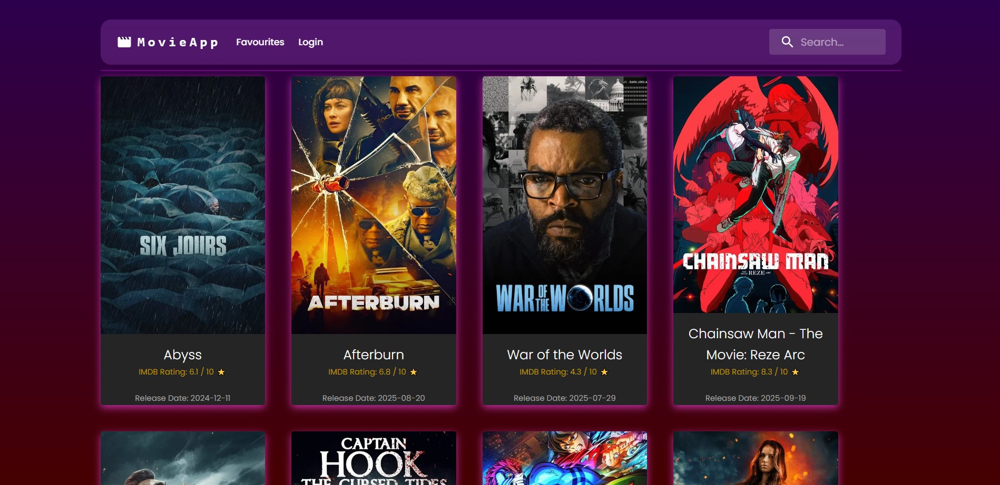
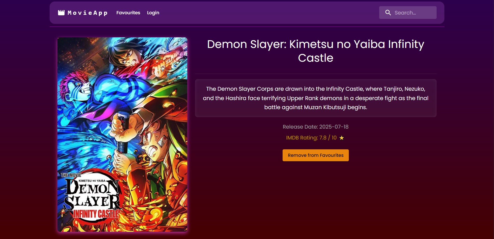
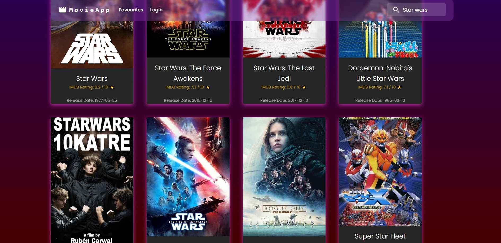

# CineInfo - Movie Discovery App

This is a dynamic, multi-page web application for searching, discovering, and favoriting movies, built with a modern React stack. This project was built to demonstrate a complete understanding of frontend technologies, from data fetching and state management to UI and routing.

---

## Features

* **Movie Search:** Fetch movies from a live API as the user types.
* **Dynamic Pages:** Click any movie to see a dedicated details page (e.g., `/movie/123`).
* **Favorites System:** Add or remove movies from a "favorites" list.
* **Persistent State:** User's favorites are saved in `localStorage` (via Zustand) and are not lost on refresh.
* **Responsive Design:** A clean, responsive UI that works on desktop and mobile.

---

## Technologies Used

* **Frontend:** React, JavaScript
* **UI Library:** Material-UI (MUI)
* **Routing:** React Router
* **Data Fetching:** React Query (TanStack Query)
* **Global State:** Zustand
* **API:** The Movie Database (TMDB)
* **Build Tool:** Vite

---

## How to Run Locally

1.  Clone the repository:
    `git clone https://github.com/sashamelnyk0/movie-app.git`
2.  Install dependencies:
    `npm install`
3.  Run the development server:
    `npm run dev`
